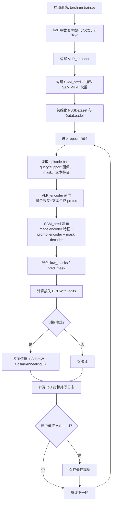

# VLP-SAM 仓库解析与运行指南（中文）

## 1) 仓库结构与职责

- `train.py`：训练主入口，包含分布式初始化、模型构建、数据集构建、训练/验证循环与日志保存。
- `SAM2pred.py`：把 VLP Encoder 产生的原型（protos）作为 prompt 输入 SAM，得到分割掩码。
- `model/VLP_encoder.py`：核心编码器，融合视觉特征（CLIP/ResNet/VGG）与可选文本特征，输出给 SAM 的 prompt 原型。
- `data/dataset.py`：统一 few-shot 数据集入口（PASCAL/COCO），并构建 DataLoader。
- `train.sh`：单机单卡训练示例命令。
- `compose.yaml` + `Dockerfile`：推荐运行环境（CUDA 12.4 + Python 3.11.5 + 依赖安装）。
- `README.md`：数据准备、目录结构、权重下载和参数说明。

## 2) 训练主流程图



## 3) 你该如何运行（推荐 Docker）

### 步骤 1：启动容器

```bash
git clone <your_repo_url>
cd VLP-SAM
docker compose up -d
```

然后进入容器：

```bash
docker compose exec vlpsam /bin/bash
```

### 步骤 2：准备数据集目录

按 README 的结构，在仓库同级准备 `../Datasets_HSN/`：

- `../Datasets_HSN/VOC2012/...`
- `../Datasets_HSN/COCO2014/...`

确保 `--datapath` 指向这个根目录（示例为 `../Datasets_HSN/`）。

### 步骤 3：准备权重

至少需要 SAM 权重：

- `weights/SAM/sam_vit_h_4b8939.pth`

### 步骤 4：运行训练

最简单先跑示例脚本：

```bash
bash train.sh
```

或者手动执行（可改参数）：

```bash
torchrun --nproc_per_node=1 train.py \
  --datapath '../Datasets_HSN/' \
  --weightpath 'weights/' \
  --benchmark 'coco' \
  --logpath 'coco_CS-ViT-B16_f-0' \
  --backbone 'CS-ViT-B/16' \
  --fold 0 \
  --condition 'mask' \
  --lr 1e-4 \
  --bsz 8 \
  --epochs 50 \
  --nworker 2 \
  --local_rank 0 \
  --text 'yes'
```

## 4) 常见运行注意事项

- `train.py` 使用 `dist.init_process_group(backend='nccl')`，默认需要 GPU/CUDA 环境。
- 如果是多卡，调大 `--nproc_per_node` 并按需调整 `--bsz`。
- 首次运行时，`SAM2pred.py` 会把查询图像特征缓存到 `weights/SAM/<benchmark>/` 下的 `.npy` 文件，后续可加速。
- `--text yes/no` 控制是否启用文本特征分支（VLP-SAM vs 视觉-only 变体）。
- 输出日志和最佳模型会按 `--logpath` 保存（通过 `common/logger.py`）。

## 5) 快速自检清单

- [ ] `weights/SAM/sam_vit_h_4b8939.pth` 已就位
- [ ] `--datapath` 指向 `../Datasets_HSN/`
- [ ] 数据目录命名与 README 保持一致
- [ ] GPU 可用（`nvidia-smi` 正常）
- [ ] `torchrun` 参数与设备数匹配

